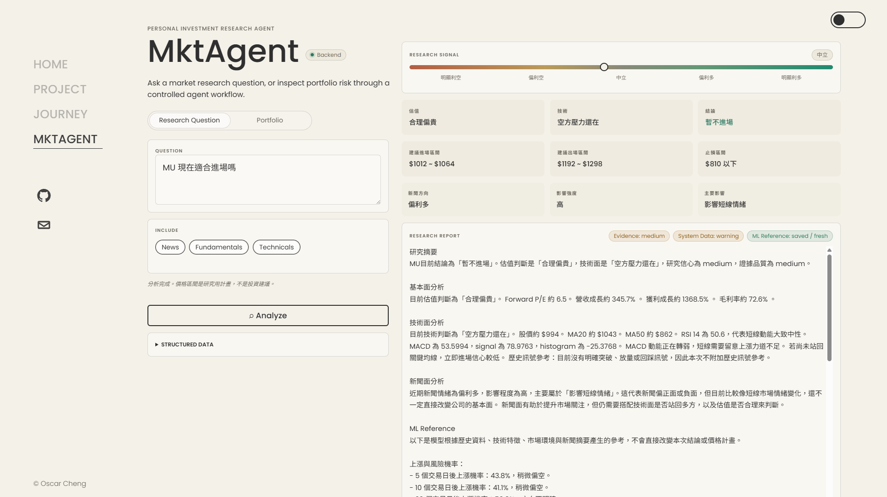
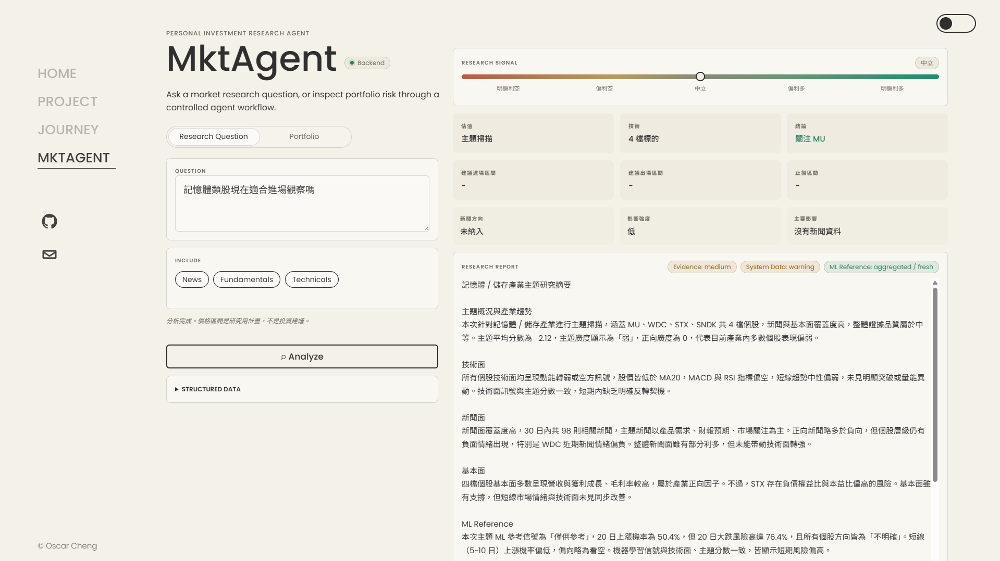
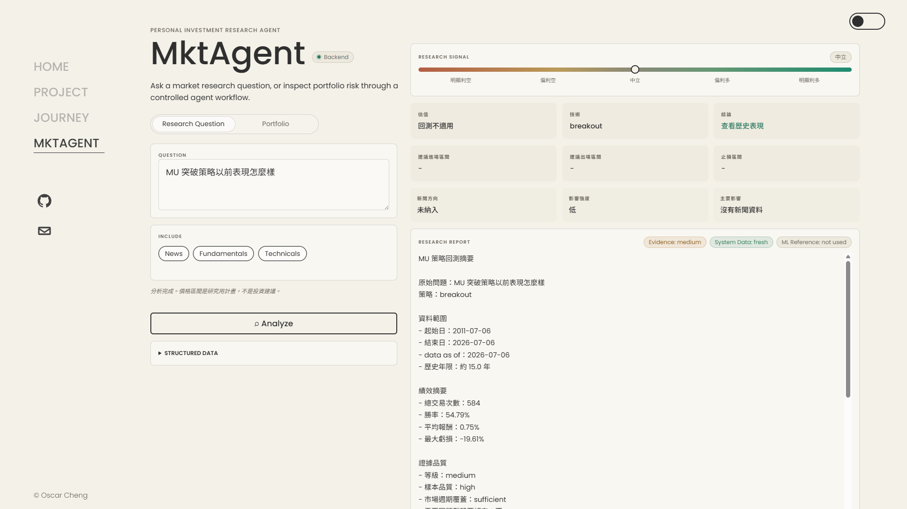
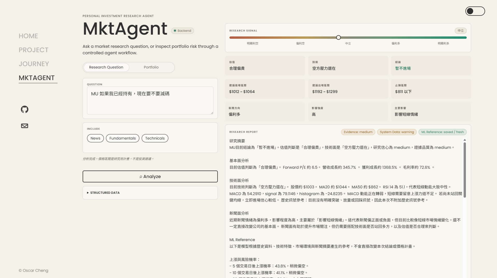
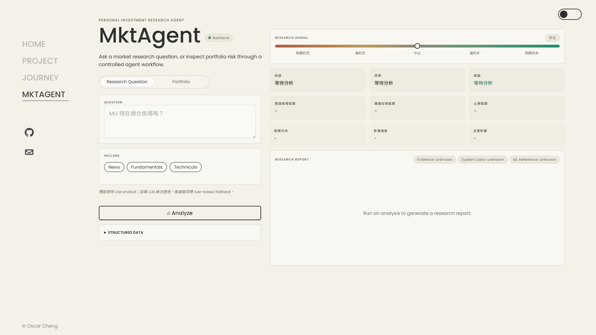

# Market Agent

Market Agent 是一個個人投資研究系統，用來把股票價格、技術指標、基本面、新聞、策略回測與 ML Reference 整合成結構化研究報告。

它不是自動交易系統，也不是投資建議工具。  
它的目標是讓我可以用比較穩定、可追蹤、可驗證的方式研究股票與市場主題。

## 為什麼做這個專案

我一開始想做的是自己的個人股票問答系統，讓我可以用自然語言詢問單股、類股、策略回測與持有風險。

這個專案整合 agent workflow、ML Reference、Supabase、GitHub Actions、Render 部署等技術。

Market Agent 的設計方向不是直接讓 LLM 憑空回答，而是先整理資料，再讓系統產生研究報告。

目前它會先處理：

- 股價與技術面訊號
- 基本面快照
- 新聞分類與新聞影響
- 策略回測結果
- ML Reference
- 資料新鮮度
- 證據品質

最後再把這些資訊整理成前端可以閱讀的 Research Report。

延伸閱讀：

- [Architecture](docs/architecture.md)
- [Frontend and Research Report Guide](docs/frontend_report_guide.md)

## Demo 

### 單股研究

```text
MU 現在適合進場嗎
```



說明文件：[Frontend and Research Report Guide](docs/frontend_report_guide.md)

### 產業 / 主題研究

```text
記憶體類股現在適合進場觀察嗎
```



### 策略回測

```text
MU 突破策略以前表現怎麼樣
```



說明文件：[Backtesting](docs/backtesting.md)

### 持有風險與出場觀察

```text
MU 如果我已經持有，現在要不要減碼
```



## 目前功能

Market Agent 目前支援：

- 單股研究報告
- 產業 / 主題掃描
- `breakout`、`volume_surge`、`pullback` 策略回測
- 基本面資料快照
- 新聞收集、分類與摘要
- 技術指標與市場環境資料
- ML Reference
- 歷史相似情境參考
- 持有風險 / 出場觀察
- 資料新鮮度檢查
- Supabase 資料儲存
- GitHub Actions 自動化
- Render 後端部署

Portfolio workflow 目前仍保留，但不是現階段主要展示重點。

更多設計細節：

- [Architecture](docs/architecture.md)
- [Backtesting](docs/backtesting.md)
- [ML Reference](docs/ml_reference.md)

## 系統大致怎麼運作

Market Agent 目前是一個後端 API，加上一個個人網站上的前端頁面。

後端採用 controlled agent workflow。  
它不是讓 LLM 自由決定所有事情，而是先由 router 判斷問題類型，再由 MarketManagerAgent 協調不同分析模組，例如 technical、news、fundamental、backtest、ML reference 與 evidence quality。

大致流程：

1. 使用者在前端輸入研究問題。
2. Router 判斷問題類型。
3. MarketManagerAgent 選擇對應 workflow。
4. 各分析模組產生 structured data。
5. 系統補上資料新鮮度、證據品質與 ML Reference 狀態。
6. Research Report 產生後，Review Layer 檢查數字、風險揭露、ML trust 與段落是否一致。
7. 未通過且已開啟 hybrid review 時，系統最多進行三輪受控修正。
8. 前端顯示報告、摘要卡、資料狀態、ML Reference 狀態與 structured data。

詳細說明：[Architecture](docs/architecture.md)

## ML Reference

ML Reference 是輔助研究訊號，不會直接改變最後結論或價格計畫。

目前會提供：

- 5 個交易日後上漲機率
- 10 個交易日後上漲機率
- 20 個交易日後上漲機率
- 20 個交易日內中途大跌風險
- 歷史報酬區間
- 實驗版報酬模型估算

如果模型健康度、校準或資料狀態不夠好，系統會顯示降低信任狀態。

詳細說明：[ML Reference](docs/ml_reference.md)

## 資料與自動化

目前資料主要透過 pipeline 更新到 Supabase。

自動化包含：

- 每日價格資料
- 技術指標
- 市場環境
- 基本面資料
- 新聞資料
- ML prediction
- prediction outcome
- ML health monitoring
- email alert

GitHub Actions 負責排程執行。  
Render 負責部署後端 API。

詳細說明：

- [Data Pipeline](docs/data_pipeline.md)
- [Outcome Tracking](docs/outcome_tracking.md)
- [Deployment](docs/deployment.md)

## 前端

前端目前放在個人網站專案中，主要用途是展示 Market Agent 的研究介面。



詳細說明：[Frontend and Research Report Guide](docs/frontend_report_guide.md)

## 每天 / 每週測試維護

為了讓系統維持穩定，我會固定用幾組問題檢查資料、報告格式與 ML Reference 狀態。

### 每天必測

```text
MU 現在適合進場嗎
記憶體類股現在適合進場觀察嗎
MU 突破策略以前表現怎麼樣
MU 如果我已經持有，現在要不要減碼
```

每天主要檢查：

- `System Data` 是否為 `fresh` 或合理的 `warning`。
- `ML Reference` 是否正常，單股分析不應長期停在 `fallback`。
- 單股報告是否包含基本面、技術面、新聞面與 ML Reference。
- 類股報告是否包含主題概況、基本面、新聞面、技術面與 ML Reference。
- 回測報告是否維持固定格式，且沒有被 LLM 改寫數字邏輯。
- 持有風險問題是否出現「持有風險 / 出場觀察」。

### 每週加測

```text
NVDA 現在適合進場嗎
AAPL 現在適合進場嗎
半導體類股現在適合進場觀察嗎
MU 放量策略以前表現怎麼樣
MU 拉回策略以前表現怎麼樣
```

每週加測用來檢查不同股票、不同主題與不同策略是否仍能正常運作。
GitHub Actions 會在台灣時間每週六 `10:30` 自動執行這五題，將完整報告寄到通知信箱，並保留 workflow artifact。

## 專案狀態

已完成的主要部分：

- research question routing
- single-stock report stabilization
- theme report support
- backtest report stabilization
- ML Reference integration
- data freshness checks
- Supabase pipeline
- GitHub Actions automation
- Render backend deployment

接下來會繼續整理：

- Research Signal Outcome Tracking
- 自動化維護流程
- portfolio workflow refactor
- frontend redesign / monitoring UI

詳細規劃：[Roadmap](docs/roadmap.md)

## 文件

README 只放專案概覽。  
細節會拆到多個較短的文件中。

主要文件：

- [Architecture](docs/architecture.md)
- [Frontend and Research Report Guide](docs/frontend_report_guide.md)
- [Data Pipeline](docs/data_pipeline.md)
- [ML Reference](docs/ml_reference.md)
- [Outcome Tracking](docs/outcome_tracking.md)
- [Backtesting](docs/backtesting.md)
- [Deployment](docs/deployment.md)
- [Roadmap](docs/roadmap.md)

補充文件：

- [Supabase Schema](docs/supabase_schema.md)
- [News Sources](docs/news_sources.md)

## 不包含什麼

本專案目前不包含：

- 自動下單
- 交易執行
- 投資保證
- 絕對買入 / 賣出建議
- 完整 portfolio redesign

## Disclaimer

本專案僅供個人研究與軟體工程展示使用，不構成投資建議。

金融市場具有風險，任何交易決策都應自行評估並自行承擔結果。
