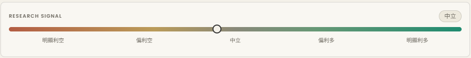
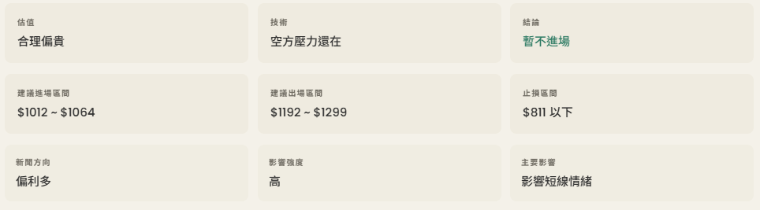

# 前端與 Research Report 解讀

這份文件用來說明 Market Agent 前端畫面與 Research Report 的閱讀方式。

範例問題：

```text
MU 如果我已經持有，現在要不要減碼
```

這題適合用來說明完整畫面，因為它同時包含：

- 單股研究
- 基本面分析
- 技術面分析
- 新聞面分析
- ML Reference
- 持有風險 / 出場觀察
- 綜合評估
- 風險提醒

## 畫面範例


## Research Signal

Research Signal 是畫面最上方的線性訊號條。



它不是買賣指令，而是把本次研究的綜合分數轉成一個比較直覺的位置。

前端目前用以下方式計算：

```text
raw score = 50 + combined_score * 9 - risk_penalty
```

其中：

- `combined_score` 來自技術面、新聞面、基本面與風險分數。
- `risk_penalty` 會依照風險等級扣分。
- 最後分數會限制在 0 到 100 之間。

線性區間大致代表：

| 分數區間 | 顯示文字 | 意思 |
| --- | --- | --- |
| 0-19 | 明顯利空 | 多數訊號偏弱，風險或負面因素較明顯。 |
| 20-39 | 偏利空 | 整體偏弱，但不一定是極端負面。 |
| 40-59 | 中立 | 多空訊號不夠明確，或不同面向互相抵銷。 |
| 60-79 | 偏利多 | 整體偏正向，但仍需要搭配風險控管。 |
| 80-100 | 明顯利多 | 多數訊號明顯偏正向。 |

## 研究摘要九宮格（Research Snapshot）

Research Signal 下方的九格是快速摘要，不是完整分析。



### 第一排：核心判斷

| 欄位 | 用途 |
| --- | --- |
| 估值 | 快速判斷目前基本面估值是偏貴、偏便宜或資料不足。 |
| 技術 | 快速判斷短線技術面是多方較強、空方壓力仍在，或方向不明。 |
| 結論 | 根據估值、技術與新聞方向產生的目前研究結論。 |

估值常見狀態：

| 狀態 | 意思 |
| --- | --- |
| 明顯偏貴 | Forward P/E、Trailing P/E 或 Price/Sales 明顯偏高。 |
| 合理偏貴 | 估值偏高，但未到極端。 |
| 合理偏便宜 | 估值相對不高，且營收成長為正。 |
| 估值中立 | 資料不足以判斷明顯偏貴或偏便宜。 |
| 估值資料不足 | 基本面資料抓取失敗或缺少關鍵欄位。 |
| 未納入基本面 | 本次使用者沒有勾選 Fundamentals。 |

技術常見狀態：

| 狀態 | 意思 |
| --- | --- |
| 多方比較有力 | 短線趨勢偏強，且股價在 MA20 上方。 |
| 空方壓力還在 | 短線趨勢偏弱，或股價仍低於 MA20。 |
| 接近支撐觀察區 | 價格接近 MA20，可觀察支撐是否有效。 |
| 多方剛發動，還要確認 | 有突破或放量訊號，但仍需要確認是否延續。 |
| 多空方向不明 | 目前沒有明確技術方向。 |

結論常見狀態：

| 狀態 | 意思 |
| --- | --- |
| 暫不進場 | 技術面偏弱，立即進場信心較低。 |
| 等待更好價格 | 估值明顯偏貴，較適合等待價格修正。 |
| 觀察回踩有效 | 價格接近支撐區，可觀察支撐是否成立。 |
| 可列入觀察 | 技術面偏正向，且新聞面沒有明顯利空。 |
| 降低進場信心 | 新聞情緒偏負面，會降低短線信心。 |
| 還需要觀察 | 訊號不夠明確。 |

### 第二排：價格計畫

| 欄位 | 用途 |
| --- | --- |
| 建議進場區間 | 以 MA20 或目前價格作為基準，產生研究用進場觀察區。 |
| 建議出場區間 | 以目前價格或進場上緣往上推估的研究用出場觀察區。 |
| 止損區間 | 以 MA50 或進場基準往下推估的研究用風險控管區。 |

這三格是價格計畫，不代表系統正在建議立刻下單。

### 第三排：新聞影響

| 欄位 | 用途 |
| --- | --- |
| 新聞方向 | 最近新聞整體偏利多、偏利空或中立。 |
| 影響強度 | 依照高重要性新聞數量與情緒方向估計新聞影響程度。 |
| 主要影響 | 判斷新聞主要是在影響財報預期、短線情緒、產品需求或其他因素。 |

新聞主要影響常見狀態：

| 狀態 | 意思 |
| --- | --- |
| 影響財報預期 | 新聞與營收、獲利、財測或產業需求有關。 |
| 有風險消息 | 新聞與官司、監管、總經或其他不確定性有關。 |
| 分析師看法改變 | 新聞主要來自升評、降評或目標價調整。 |
| 有產品或需求題材 | 新聞與新產品、AI、晶片、server、訂單或需求題材有關。 |
| 影響短線情緒 | 新聞偏正面或負面，但比較像短線市場情緒變化。 |
| 只是市場在關注 | 新聞偏中性，代表市場正在討論，但方向不明。 |
| 沒有新聞資料 | 沒有抓到新聞，或本次沒有勾選 News。 |

## Research Report

Research Report 是主要閱讀區。

它會把 structured data 整理成比較自然的段落，但核心數字與狀態仍然來自後端資料。

### 研究摘要

研究摘要用來快速回答這次問題的核心結論。

它會整理：

- 目前結論
- 估值判斷
- 技術判斷
- 研究信心
- 證據品質

### 基本面分析

基本面分析用來說明公司目前的估值與財務基本狀況。

常見內容包含：

- Forward P/E 或 Trailing P/E
- 營收成長
- 獲利成長
- 毛利率
- 可能的估值或財務風險

### 技術面分析

技術面分析用來說明目前價格、均線與動能狀態。

常見內容包含：

- 目前股價
- MA20
- MA50
- RSI 14
- MACD、signal、histogram
- 突破、放量或回踩訊號
- 歷史技術訊號參考

### 新聞面分析

新聞面分析用來說明近期新聞對判斷的影響。

它會整理：

- 新聞情緒
- 影響程度
- 主要影響類型
- 新聞是否會提高或降低短線信心

新聞面不會單獨決定結論，仍需要搭配技術面、基本面與價格計畫。

### ML Reference

ML Reference 是機器學習參考訊號。

它不會直接改變最後結論或價格計畫，而是作為額外的風險與機率參考。

### 上漲與風險機率

這段用來顯示模型對未來 5、10、20 個交易日的方向參考。

常見內容包含：

- 5 個交易日後上漲機率
- 10 個交易日後上漲機率
- 20 個交易日後上漲機率
- 20 個交易日內中途大跌風險

這些數字是模型參考，不是預測保證。

### 歷史相似情境參考

這段用來說明過去類似情境的歷史結果。

常見內容包含：

- 相似樣本數
- 證據品質
- 5 / 10 / 20 個交易日歷史報酬區間
- 20 個交易日內中途最大跌幅區間

它的用途是把目前情境放回歷史資料中比較，而不是只看單次模型輸出。

### 報酬模型估算

這段是實驗版報酬模型的輸出。

常見內容包含：

- 模型估算 5 個交易日報酬
- 模型估算 10 個交易日報酬
- 模型估算 20 個交易日報酬
- 模型估算 20 個交易日內中途最大跌幅
- 模型品質

目前這段仍是實驗參考，歷史相似情境仍然是更主要的參考來源。

### ML 信任說明

ML Reference 後面會顯示：

```text
ML 信任說明:
- 信任狀態
- 狀態說明
- 主要原因
- 支持證據
- 使用方式
```

這段會把模型健康度、校準、資料品質、訊號品質、prediction freshness、歷史樣本與 downside overlay 整理成自然語言。完整原因仍保留在 Structured Data 的 `ml_trust_explanation`。

### 持有風險 / 出場觀察

這段只會在持有相關問題中出現，例如：

```text
MU 如果我已經持有，現在要不要減碼
```

它會整理：

- exit signal
- 20 日轉弱風險
- 轉弱原因
- 持有者需要檢查的事情

目前 exit signal 可能出現：

| 狀態 | 意思 |
| --- | --- |
| `hold` | 目前沒有明顯需要調整的轉弱訊號。 |
| `watch` | 有一些需要觀察的風險，但還不到明確減碼。 |
| `reduce` | 轉弱訊號較明確，若已持有應提高風險控管。 |
| `exit` | 風險訊號更強，應嚴格檢查是否符合原本出場條件。 |

這是持有風險觀察，不是直接買賣指令。

### 綜合評估

綜合評估用來把基本面、技術面、新聞面與證據品質合併成最後說明。

常見內容包含：

- 綜合分數
- 目前結論
- 風險等級
- 證據品質
- 是否需要查看 Structured Data

### 風險提醒

風險提醒會固定說明：

- 這份輸出不構成投資建議。
- 新聞、價格資料與回測結果可能延遲或不完整。
- 使用者仍需搭配自己的風險承受度、部位大小與停損規劃。
- 如果有資料新鮮度或完整性提醒，應查看 Structured Data。

## 狀態 Badge

前端右上角會顯示幾個狀態 Badge，用來快速提醒這次研究的資料與證據狀態。

| Badge | 用途 |
| --- | --- |
| Evidence | 顯示本次研究的證據品質，例如 `high`、`medium`、`low`。 |
| System Data | 顯示系統資料狀態，例如價格、技術指標、新聞、pipeline 或回測資料日期。 |
| ML Reference | 顯示 ML Reference 的來源與狀態，例如 `saved / fresh`、`aggregated / fresh`、`fallback` 或 `not used`。 |

常見狀態：

| 狀態 | 意思 |
| --- | --- |
| `fresh` | 資料狀態正常。 |
| `warning` | 資料可以使用，但有需要留意的提醒。 |
| `stale` | 資料過舊，應先更新。 |
| `saved / fresh` | 使用已儲存且新鮮的單股 ML prediction。 |
| `aggregated / fresh` | 使用主題內成分股聚合後的 ML Reference。 |
| `fallback` | 沒有可用 saved prediction，改用 runtime fallback。 |
| `not used` | 這個 workflow 不使用 ML Reference，例如策略回測。 |

System Data 判斷 daily price 時，會使用 expected latest trading day。  
如果交易日當天還沒到美股收盤後的預期更新時間，系統不會強迫要求當天日線資料已經存在。

## Structured Data

Structured Data 是 Research Report 背後的原始結構化資料。

它適合用來檢查：

- 後端判斷出的 intent
- request options
- technical / news / fundamentals
- ML Reference
- exit signal
- evidence quality
- data freshness
- analyst mode

一般閱讀時不一定需要打開，但 demo 或 debug 時很重要。

## 實際 Research Report 範例

以下是一份「MU 如果我已經持有，現在要不要減碼」的實際輸出範例。

這是某次實際執行結果，股價、均線、新聞、ML 機率與資料狀態會隨資料更新而改變。

```text
研究摘要
MU目前結論為「暫不進場」。估值判斷是「合理偏貴」，技術面是「空方壓力還在」，研究信心為 medium，證據品質為 medium。

基本面分析
目前估值判斷為「合理偏貴」。 Forward P/E 約 6.5。 營收成長約 345.7% 。 獲利成長約 1368.5% 。 毛利率約 72.6% 。

技術面分析
目前技術判斷為「空方壓力還在」。 股價約 $984。 MA20 約 $1043。 MA50 約 $862。 RSI 14 為 50.1，代表短線動能大致中性。 MACD 為 52.7865，signal 為 78.8137，histogram 為 -26.0271。 MACD 動能正在轉弱，短線需要留意上漲力道不足。 若尚未站回關鍵均線，立即進場信心較低。 歷史訊號參考：目前沒有明確突破、放量或回踩訊號，因此本次不附加歷史訊號參考。

新聞面分析
近期新聞情緒為偏利多，影響程度為高，主要屬於「影響短線情緒」。這代表新聞偏正面或負面，但目前比較像短線市場情緒變化，還不一定直接改變公司的基本面。 新聞面有助於提升市場關注，但仍需要搭配技術面是否站回多方，以及估值是否合理來判斷。

ML Reference
以下是模型根據歷史資料、技術特徵、市場環境與新聞摘要產生的參考，不會直接改變本次結論或價格計畫。

上漲與風險機率：
- 5 個交易日後上漲機率：43.8%，稍微偏空。
- 10 個交易日後上漲機率：41.1%，稍微偏空。
- 20 個交易日後上漲機率：50.8%，方向不明確。
- 20 個交易日內中途大跌風險：77.9%，中途大跌風險偏高。

歷史相似情境參考:
- 相似樣本數：479 筆。
- 證據品質：高。
- 5 個交易日歷史報酬區間：-2.4% ~ +4.8%。
- 10 個交易日歷史報酬區間：-3.8% ~ +8.6%。
- 20 個交易日歷史報酬區間：-3.7% ~ +13.1%。
- 20 個交易日內中途最大跌幅區間：-9.0% ~ -1.3%。

報酬模型估算:
- 這是第一版實驗模型，仍以歷史區間作為主要參考。
- 模型估算 5 個交易日報酬：+1.7%，估算區間 -4.5% ~ +6.7%，模型品質 低到中。
- 模型估算 10 個交易日報酬：+4.6%，估算區間 -4.2% ~ +7.9%，模型品質 低到中。
- 模型估算 20 個交易日報酬：+9.1%，估算區間 -5.1% ~ +14.3%，模型品質 低。
- 模型估算 20 個交易日內中途最大跌幅：-8.3%，估算區間 -11.4% ~ -2.3%，模型品質 低到中。

ML Reference 目前為降低信任狀態，相關數字應保守解讀。

持有風險 / 出場觀察
目前 exit signal 為「reduce」，20 日轉弱風險為「high」。目前出現較明確的轉弱訊號，若已持有應提高風險控管。 20 日轉弱風險為 high。 若已持有，應檢查部位大小、停損位置與是否接近原本的出場計畫。 這是持有風險觀察，不是直接買賣指令。

綜合評估
綜合分數為 0.50。 基本面、技術面與新聞面合併後，目前結論為「暫不進場」，風險等級為 medium。證據品質為 medium，詳細資訊放在 Structured Data。 價格計畫可作為後續觀察區間，但不代表現在一定適合進場。

風險提醒
- 這份輸出只整理資料與策略訊號，不構成投資建議。
- 新聞、價格資料與回測結果都可能延遲或不完整。
- 進出場仍需要搭配個人風險承受度、部位大小與停損規劃。
- 目前有資料新鮮度或完整性提醒，詳細資訊放在 Structured Data。
```
